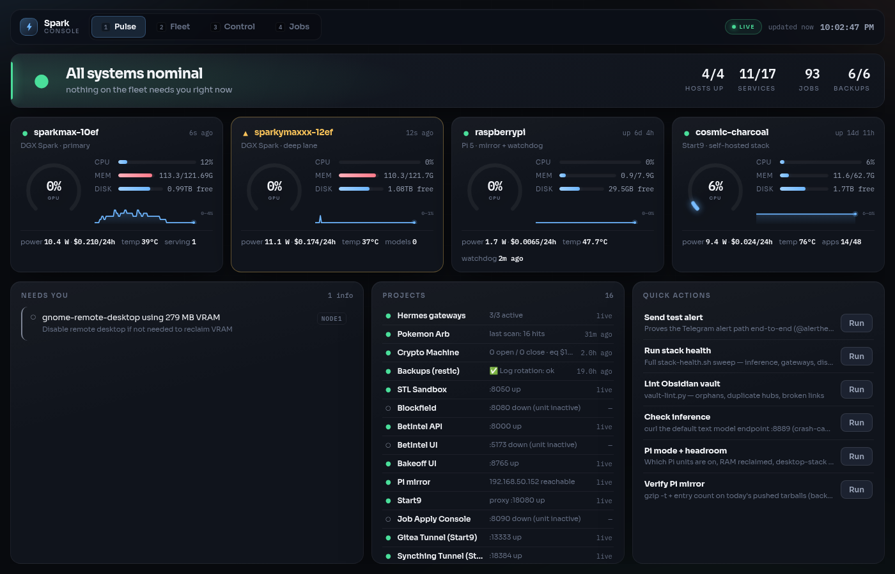

# Spark Console




Local **GPU + fleet dashboard** for NVIDIA DGX Spark (Grace Blackwell, unified memory) — and any Linux box with an NVIDIA GPU. Pulse, fleet cards, a read-only services board. Nothing phones home.

Default UI: **http://127.0.0.1:8085/**

This public tree is the **portable core**: collectors, the UI, and a read-only service board. It runs standalone. The hero screenshot is a **live dual-Spark run** on the author’s box (your clone shows *your* hosts and units, not that fleet).

## At a glance

| | |
|---|---|
| **What it is** | **Spark Console** — a local GPU/system dashboard for NVIDIA DGX Spark: live graphs, model inventory, endpoint health, and a read-only service board. |
| **What it’s for** | See GPU, memory, model and service health in one page on `localhost` — without phoning home, and without a cloud account. |
| **How to use it** | `./setup.sh` → open **http://127.0.0.1:8085/**. Stop with `./stop.sh`. |

## Try it (pick one)

### One command
```bash
git clone https://github.com/Coinupbtc/spark-console.git
cd spark-console && ./setup.sh
# open http://127.0.0.1:8085/
```

### Copy-paste
```bash
git clone https://github.com/Coinupbtc/spark-console.git && cd spark-console
python3 -m venv .venv && .venv/bin/pip install -r requirements.txt
./start.sh
```

### Already cloned
```bash
./setup.sh
```

Runtime data stays in local `data/` (gitignored). Nothing phones home.

## What you get

| Path | What |
|------|------|
| `console.html` | The console UI |
| `server.py` | Read-only HTTP API (see the route list in its docstring) |
| `collector.py` | Performance snapshots → `data/` (CSV + latest JSON) |
| `services_lite.py` | Service board driven by your `services.json` |
| `remote_node.py` | Optional second node over SSH |
| `cluster_metrics.py` | Two-node metrics + degraded-node alerting |
| `baseline_summary.py` | Percentiles, availability, longest-run report |
| `todos_lite.py` | Local scratch list for the console panel |
| `setup.sh` / `start.sh` / `stop.sh` | One-command lifecycle |

## The service board

Copy the example and edit it — the board is empty until you do:

```bash
cp services.example.json services.json
```

Each entry needs an `id` plus at least one of `unit`, `port`, or `probe_url`:

```json
{"services": [
  {"id": "ollama", "label": "Ollama", "group": "inference",
   "unit": "ollama.service", "port": 11434, "critical": true}
]}
```

`critical: true` raises an alert when that service is not running. The board is **read-only** — the console reports state and never starts or stops anything.

## Optional second node

Point it at another machine over SSH and its metrics join the graphs:

```bash
export NODE2_HOST=user@second-node.example     # or NODE2_SSH_ALIAS=mynode from ~/.ssh/config
export NODE2_SSH_KEY=~/.ssh/id_ed25519   # pin an identity (needed under systemd)
./start.sh
```

Unset, the console is simply a single-node dashboard — no errors, no alerts.

## Environment

| Var | Default | Meaning |
|---|---|---|
| `PORT` / `HOST` | `8085` / `127.0.0.1` | Bind address |
| `CONSOLE_ALLOWED_HOSTS` | — | Extra `Host` values to accept (see Security) |
| `NODE2_HOST` / `NODE2_SSH_ALIAS` | — | Enable the second node |
| `NODE2_SSH_KEY` | — | SSH identity for the second node |
| `NODE2_ENDPOINTS` | `8000,8080,11434` | Remote ports probed for `/v1/models` |
| `SPARK_CONSOLE_SERVICES` | `./services.json` | Service board config path |
| `SPARK_CONSOLE_SYSTEMD_SCOPE` | `--user` | Use `--system` for system units |
| `NOTIFY_HOOK` | — | Executable taking `--plain <msg>`, paged when node2 degrades |
| `DGX_DATA_DIR` | `./data` | Where snapshots and the CSV live |

## Security

The console binds `127.0.0.1` only, which is necessary but **not sufficient** — a
localhost HTTP server is still reachable from any page your browser loads. Two
defences are built in:

* **`Host` allowlist** — blocks DNS rebinding, where a page on `evil.com`
  re-points its own hostname at `127.0.0.1` to become same-origin with the
  console and read every endpoint. Foreign `Host` headers get a `400`.
* **`Origin` check on writes** — a cross-origin `POST` with no custom headers is
  a "simple request", so no CORS preflight would stop it. Foreign `Origin`
  values get a `403`. Requests with *no* `Origin` (curl, scripts) still work.

To reach the console from another machine, prefer an SSH tunnel — the `Host`
stays `localhost`, so nothing needs configuring:

```bash
ssh -L 8085:127.0.0.1:8085 user@your-spark
```

If you must serve a real hostname, add it explicitly:

```bash
CONSOLE_ALLOWED_HOSTS=spark.lan ./start.sh
```

This tree exposes **no** start/stop, model-switch, or run-a-script routes; the
control plane that does is not published.

## Tests

```bash
./.venv/bin/python -m pytest tests/ -q
```

## Related

- [miaai35-tune](https://github.com/Coinupbtc/miaai35-tune)
- [spark-training-lab](https://github.com/Coinupbtc/spark-training-lab)
- [zwell-bench](https://github.com/Coinupbtc/zwell-bench)

## License

MIT
